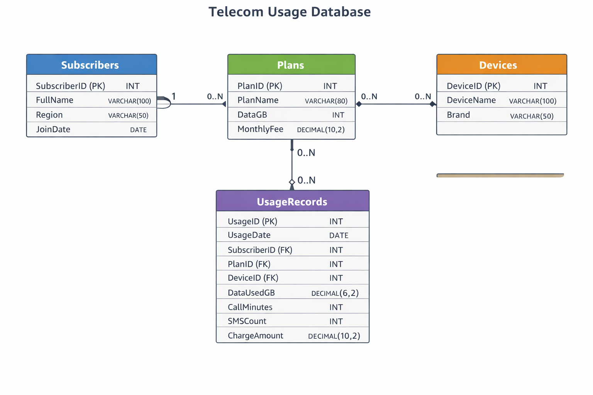
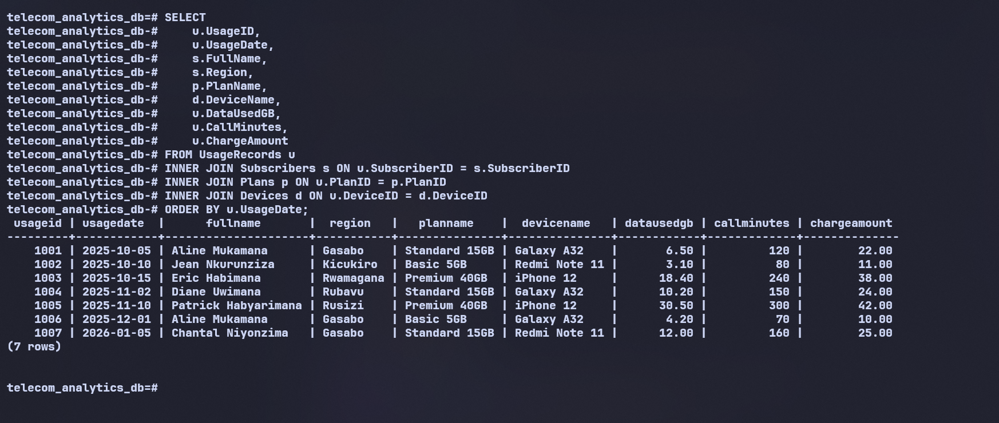
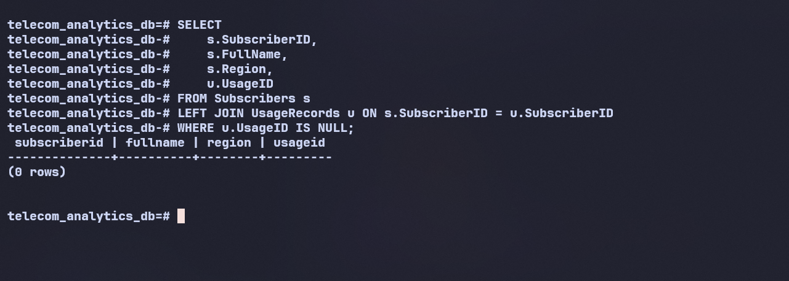
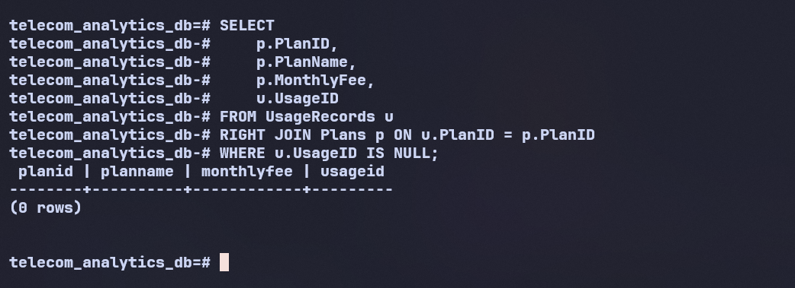
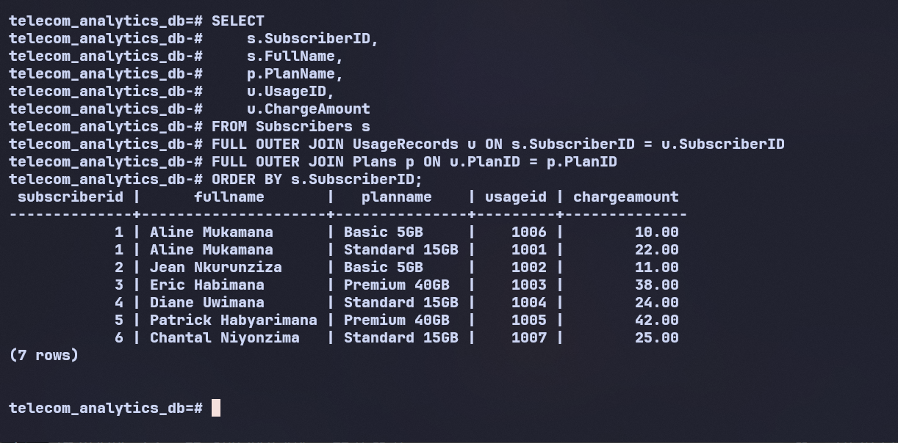
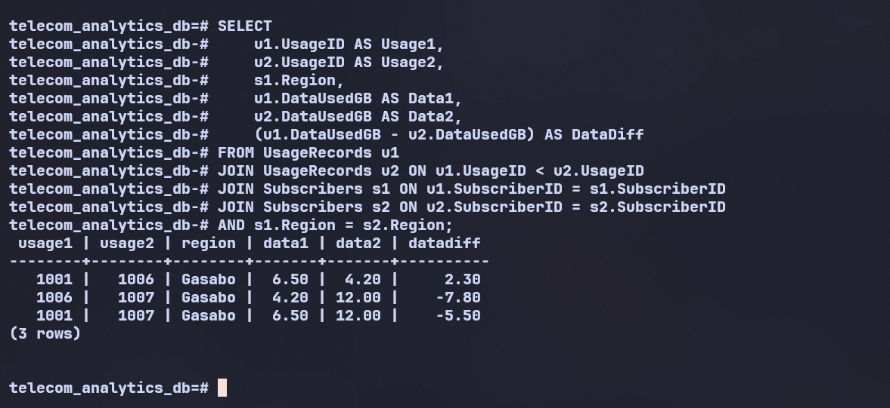
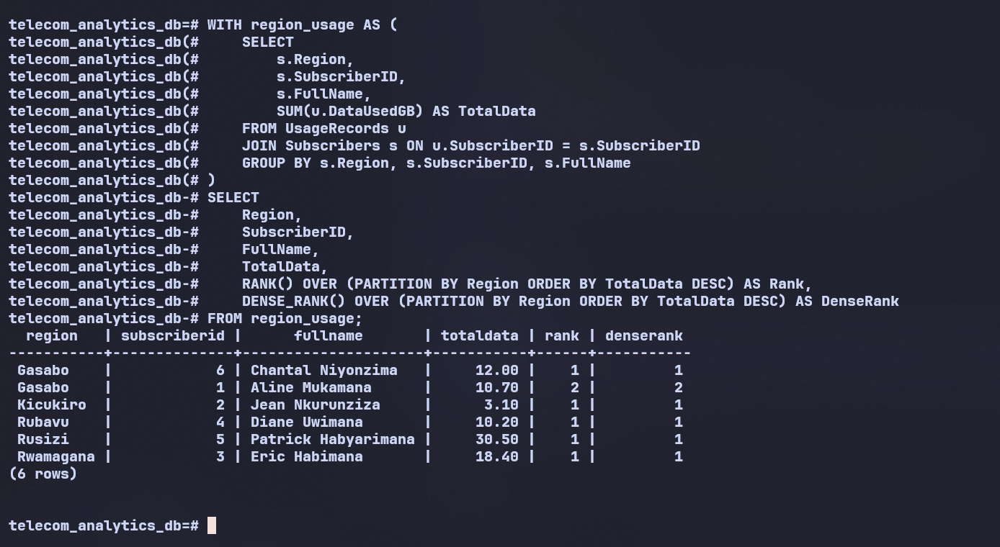
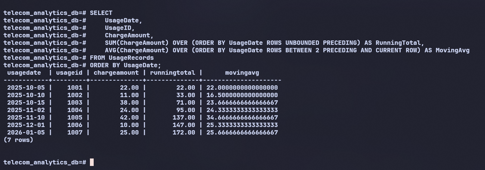
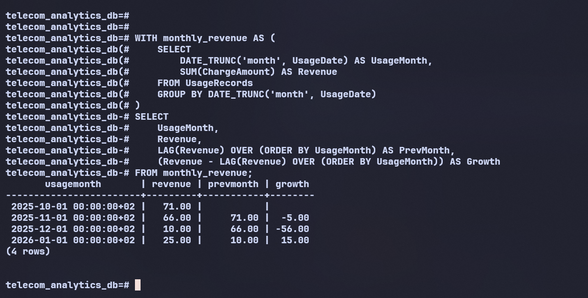
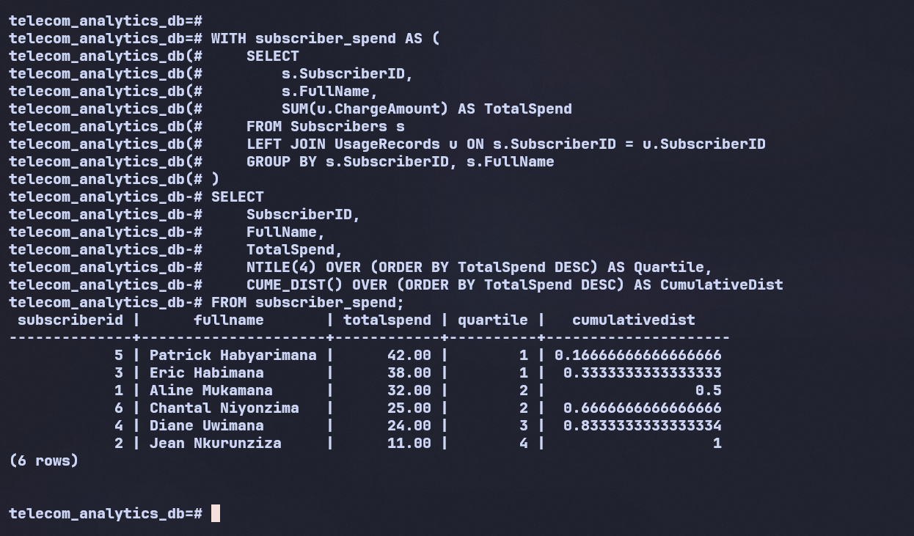

# Telecom Analytics Database

## Project Overview

This repository contains a **Telecom Analytics Database** built using SQL to simulate and analyze real-world mobile network operations. The project focuses on **subscriber behavior, usage analytics, revenue tracking, and plan performance**, using both **JOIN operations** and **advanced window functions**.

---

## Business Problem

Telecommunication companies collect massive volumes of data related to calls, data usage, SMS, devices, and billing. Without structured analytics, it becomes difficult to:

* Understand subscriber usage behavior by region
* Identify high-value vs low-value customers
* Track revenue growth over time
* Evaluate plan and device performance
* Support data-driven pricing and marketing decisions

This project addresses these challenges by designing a normalized relational database and applying analytical SQL queries to extract actionable insights.

---

## Database Schema

### Tables

* **Subscribers** (`SubscriberID`, `FullName`, `Region`, `JoinDate`)
* **Plans** (`PlanID`, `PlanName`, `DataGB`, `MonthlyFee`)
* **Devices** (`DeviceID`, `DeviceName`, `Brand`)
* **UsageRecords** (`UsageID`, `UsageDate`, `SubscriberID`, `PlanID`, `DeviceID`, `DataUsedGB`, `CallMinutes`, `SMSCount`, `ChargeAmount`)

### Relationships

* One **Subscriber** → Many **UsageRecords**
* One **Plan** → Many **UsageRecords**
* One **Device** → Many **UsageRecords**

Foreign keys enforce **referential integrity** across all tables.

---

## ER Diagram



---

## JOIN Queries

### INNER JOIN – Complete Usage Analysis

```sql
SELECT
    u.UsageID,
    u.UsageDate,
    s.FullName,
    s.Region,
    p.PlanName,
    d.DeviceName,
    u.DataUsedGB,
    u.CallMinutes,
    u.ChargeAmount
FROM UsageRecords u
INNER JOIN Subscribers s ON u.SubscriberID = s.SubscriberID
INNER JOIN Plans p ON u.PlanID = p.PlanID
INNER JOIN Devices d ON u.DeviceID = d.DeviceID
ORDER BY u.UsageDate;
```



---

### LEFT JOIN – Subscribers Without Usage

```sql
SELECT
    s.SubscriberID,
    s.FullName,
    s.Region,
    u.UsageID
FROM Subscribers s
LEFT JOIN UsageRecords u ON s.SubscriberID = u.SubscriberID
WHERE u.UsageID IS NULL;
```



---

### RIGHT JOIN – Unused Plans

```sql
SELECT
    p.PlanID,
    p.PlanName,
    p.MonthlyFee,
    u.UsageID
FROM UsageRecords u
RIGHT JOIN Plans p ON u.PlanID = p.PlanID
WHERE u.UsageID IS NULL;
```



---

### FULL OUTER JOIN – Full Coverage

```sql
SELECT
    s.SubscriberID,
    s.FullName,
    p.PlanName,
    u.UsageID,
    u.ChargeAmount
FROM Subscribers s
FULL OUTER JOIN UsageRecords u ON s.SubscriberID = u.SubscriberID
FULL OUTER JOIN Plans p ON u.PlanID = p.PlanID
ORDER BY s.SubscriberID;
```



---

### SELF JOIN – Regional Usage Comparison

```sql
SELECT
    u1.UsageID AS Usage1,
    u2.UsageID AS Usage2,
    s1.Region,
    u1.DataUsedGB AS Data1,
    u2.DataUsedGB AS Data2,
    (u1.DataUsedGB - u2.DataUsedGB) AS DataDiff
FROM UsageRecords u1
JOIN UsageRecords u2 ON u1.UsageID < u2.UsageID
JOIN Subscribers s1 ON u1.SubscriberID = s1.SubscriberID
JOIN Subscribers s2 ON u2.SubscriberID = s2.SubscriberID
AND s1.Region = s2.Region;
```



---

## Window Function Queries

### Ranking Functions (RANK & DENSE_RANK)

```sql
WITH region_usage AS (
    SELECT
        s.Region,
        s.SubscriberID,
        s.FullName,
        SUM(u.DataUsedGB) AS TotalData
    FROM UsageRecords u
    JOIN Subscribers s ON u.SubscriberID = s.SubscriberID
    GROUP BY s.Region, s.SubscriberID, s.FullName
)
SELECT
    Region,
    SubscriberID,
    FullName,
    TotalData,
    RANK() OVER (PARTITION BY Region ORDER BY TotalData DESC) AS Rank,
    DENSE_RANK() OVER (PARTITION BY Region ORDER BY TotalData DESC) AS DenseRank
FROM region_usage;
```



---

###  Aggregate Window Functions

```sql
SELECT
    UsageDate,
    UsageID,
    ChargeAmount,
    SUM(ChargeAmount) OVER (ORDER BY UsageDate ROWS UNBOUNDED PRECEDING) AS RunningTotal,
    AVG(ChargeAmount) OVER (ORDER BY UsageDate ROWS BETWEEN 2 PRECEDING AND CURRENT ROW) AS MovingAvg
FROM UsageRecords
ORDER BY UsageDate;
```



---

### Navigation Functions (LAG)

```sql
WITH monthly_revenue AS (
    SELECT
        DATE_TRUNC('month', UsageDate) AS UsageMonth,
        SUM(ChargeAmount) AS Revenue
    FROM UsageRecords
    GROUP BY DATE_TRUNC('month', UsageDate)
)
SELECT
    UsageMonth,
    Revenue,
    LAG(Revenue) OVER (ORDER BY UsageMonth) AS PrevMonth,
    (Revenue - LAG(Revenue) OVER (ORDER BY UsageMonth)) AS Growth
FROM monthly_revenue;
```



---

### Distribution Functions (NTILE & CUME_DIST)

```sql
WITH subscriber_spend AS (
    SELECT
        s.SubscriberID,
        s.FullName,
        SUM(u.ChargeAmount) AS TotalSpend
    FROM Subscribers s
    LEFT JOIN UsageRecords u ON s.SubscriberID = u.SubscriberID
    GROUP BY s.SubscriberID, s.FullName
)
SELECT
    SubscriberID,
    FullName,
    TotalSpend,
    NTILE(4) OVER (ORDER BY TotalSpend DESC) AS Quartile,
    CUME_DIST() OVER (ORDER BY TotalSpend DESC) AS CumulativeDist
FROM subscriber_spend;
```



---

## Key Insights

* Premium plans generate the highest revenue per user
* Data usage varies significantly by region
* A small group of subscribers contributes a large share of total revenue
* Revenue trend analysis reveals growth and decline periods
* Some plans show zero adoption, indicating optimization opportunities

---

## Data Integrity Statement

I confirm that this project is my original work. All SQL scripts, schema designs, and queries were written, executed, and validated by me. The database follows normalization principles, enforces referential integrity, and produces reproducible results.

---

## References

* PostgreSQL Official Documentation
* ISO/IEC SQL Standards
* Elmasri & Navathe – *Fundamentals of Database Systems*
* [SQL Window Function video](https://www.youtube.com/watch?v=Ww71knvhQ-s)

---

## Author

**Mugisha Godson 28837**
Telecom Analytics Database Project
